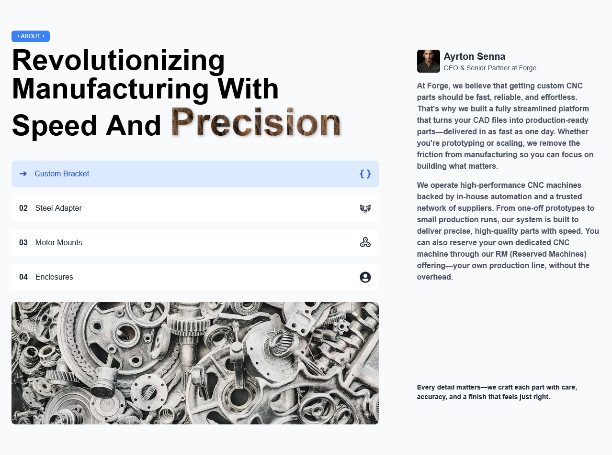

# CNC Machining Website

This is a responsive website built with **React.js** and **Tailwind CSS**, designed to showcase CNC machining services and make it easy for users to interact with features like drag & drop design uploads.

---

## 🚀 Features

- 📱 **Responsive UI** (mobile, tablet, and desktop support)
- ⚡ **Built with TypeScript** for type safety and maintainability
- 🖼️ CNC machining service details with images & animations
- 🎨 Modern UI with **Framer Motion animations**
- 📂 Interactive **Drag & Drop 3D design upload** card
- 🌀 3D model viewer using **React Three Fiber + Drei**
- 🎭 Swiper-based slider with custom animations
- 🌙 Tailwind CSS for fast and scalable styling

---

## 🛠️ Tech Stack

- **React.js + TypeScript** – Frontend framework with type safety
- **Tailwind CSS** – Utility-first CSS framework
- **Framer Motion** – Smooth animations
- **React Three Fiber (R3F)** – 3D rendering
- **Drei** – Helper components for R3F
- **Swiper.js** – Modern slider for 3D previews
- **JavaScript (ES6+)**

---

## 📂 Project Structure

```

/src
├── components    # Reusable UI components
├── assets        # Images and media
├── App.js        # Main app entry
└── index.js      # React DOM render

```

---

## 📦 Installation

1. Clone the repository
   ```bash
   git clone https://github.com/samirzjadhav/forge-website.git
   ```

````

2. Navigate to the project folder

   ```bash
   cd cnc-machining-website
   ```
3. Install dependencies

   ```bash
   npm install
   ```
4. Run the development server

   ```bash
   npm start
   ```

---

## 🌐 Live Demo

[Click Here](#) *(Add your deployed link when available)*

---

## 📸 Screenshots



---

## 🤝 Contributing

Pull requests are welcome. For major changes, please open an issue first to discuss what you would like to change.

---

## 📜 License

This project is licensed under the **MIT License**.

```
````
